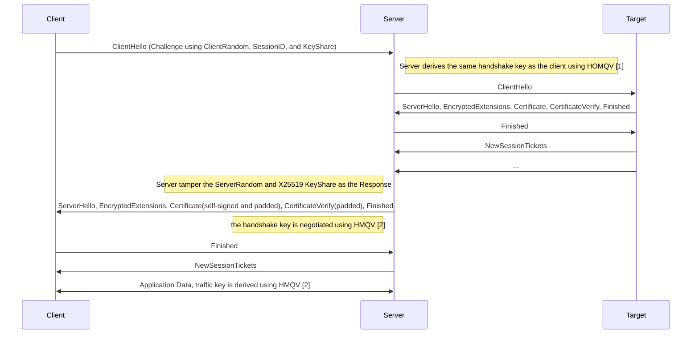
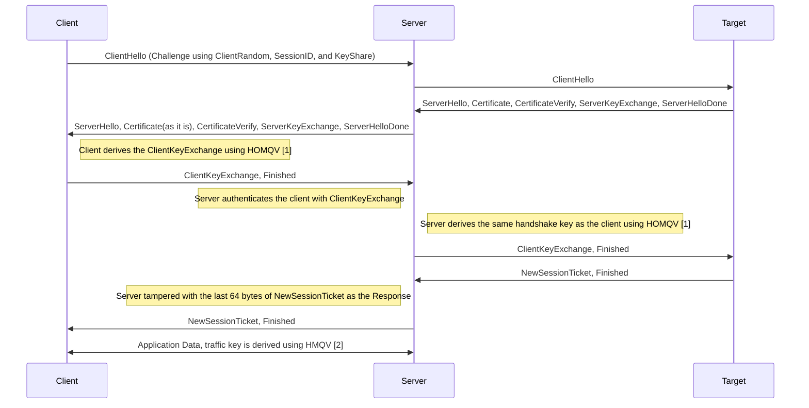

# Protean Protocol Specification

## Overview

### TLS 1.3


### TLS 1.2


## Edward25519 Operations

### Map bytes to Edward25519 scalar

To map a byte slice to an Edward25519 scalar, we use the following function, as the secret key derivation in the Ed25519 specification:

```go
func mapToScalar(b []byte) []byte {
    hs := sha512.New()
    hs.Write(b)
    h := hs.Sum(make([]byte, 0, sha512.Size))
    s, _ := new(edwards25519.Scalar).SetBytesWithClamping(h[:32])
    return s.Bytes()
}
```

To make the following specification more concise, we omit the call of `mapToScalar` function in the following sections, e.g. `r = mapToScalar(sha512(X || Y))` is equivalent to `r = sha512(X || Y)`.


## Authentication

Protean authenticates the peer using public keys, like SSH and WireGuard.
To make the handshake lightweight and secure, it uses Ed25519 keys for authentication and key exchange.
Each peer SHOULD generate a long-term Ed25519 key pair and exchange the public key prior to the handshake.
> For convenience, we use lowercase letters to denote the private key and uppercase letters for the public key. e.g. `a` is the private key and `A` is the public key.

Like SSH, we adopt the fingerprint of the public key as the identity of the peer, which is the first 16 bytes of SHA-256 hash of the public key. e.g. `fpA = sha256(A)[:16]`.

> Suppose the client has a long-term Ed25519 key pair `(b, B)`, and the server has a long-term Ed25519 key pair `(a, A)`.


### Client Challenge

Client SHOULD construct a ClientHello message by the following steps:

1. Generate an ephemeral Ed25519 key pair `(y, Y)`.
2. Calculate the shared secret using HOMQV: `K_0 = A^(y+b*e)`, where `e = sha512(Y || fpA || fpB)`.
3. Construct an HPKE suite: `box` with the following parameters:
    ```
    KEM_ID := KEM_X25519_HKDF_SHA256
    KDF_ID := KDF_HKDF_SHA512
    AEAD_ID := AEAD_AES256GCM
    ```
4. Using the Montgomery form of `A`: `A_M` as the recipient public key, and construct the sender AAD: `aad = hello.vers || hello.server_name || fpA || A`.
    ```
    sender := hpke.NewSender(A_M, aad)
    ```
5. Setup the sender with the shared secret `K_0`:
    ```
    xpk, sealer := sender.Setup(K_0)
    ```
6. Encrypt the client fingerprint `fpB` using the sender:
    ```
    obfsFpB (32 bytes) := sender.Seal(fpB, aad)
    ```
7. To resist DPI, the ephemeral public key `Y` should be obfuscated before it's sent. To make it simple, we export some key material from the sender to obfuscate the public key, instead of using Elligator2 encoding.
    ```
    obfsY := Y
    aad := hello.vers || hello.server_name || fpA || A || obfsFpB
    keyLabel := append([]byte("h public key obfuscation key"), info...)
	ivLabel := append([]byte("h public key obfuscation iv"), info...)
	encodeKey := ctx.Export(keyLabel, 32)
	block, _ := aes.NewCipher(encodeKey)
	encodeIV := ctx.Export(ivLabel, uint(block.BlockSize()))
	cipher.NewCTR(block, encodeIV).XORKeyStream(obfsY, obfsY)
    ```
8. Generate the key shares using `K_0`, the X25519 KeyShare should be set to `xpk` in step 5:
    ```
    keyShareSeed := tls13.ExpandLabel(sha512.New, K_0, "key share ${curveID} seed", Y, privateKeySeedLength)
    ```
9. Set the ClientHello fields:
   1.  `ClientRandom = obfsY`
   2. `SessionID = obfsFpB`
   3. `KeyShares`

#### TLS 1.2

In TLS 1.2, the TLS ephemeral public key is sent in the `ClientKeyExchange` message, so the KeyShare in the ClientHello message has not participated in the handshake key derivation. The key confirmation of `K_0` is performed by the `ClientKeyExchange` message.

Client SHOULD generate the `ClientKeyExchange` message using `K_0` as a seed.
```
seed := tls13.ExpandLabel(sha512.New, K_0, "client key exchange ${curveID}", Y, 66)
```

#### Rationale
The core of the process above is to use the shared secret `K_0` to derive an HPKE box, which could encrypt the client fingerprint `fpB` and obfuscate the ephemeral public key `Y`.
There are two purposes of using `K_0` to derive the KeyShares:
1. Using generated KeyShares as the key confirmation of `K_0`.
2. The server could derive the same `K_0` using the `Y` and `fpB` in the ClientHello message, and generate the same KeyShares as the client to perform the delegate handshake.

This idea is inspired by the [higncryption](https://eprint.iacr.org/2018/1165.pdf) and [HOMQV](https://eprint.iacr.org/2010/638.pdf).

### Server Response

Server SHOULD check every ClientHello message by the following steps:

1. Using the Montgomery form of `a`: `a_m` as the recipient private key, and construct the sender AAD: `aad = client_hello.vers || client_hello.server_name || fpA || A`.
    ```
    receiver := hpke.NewReceiver(a_m, aad)
    ```
2. Setup the receiver with the X25519 key share in the ClientHello message:
    ```
    opener := receiver.Setup(xpk)
    ```
3. Decrypt the client fingerprint `fpB` using the opener, and deobfuscate the ephemeral public key `Y`:
4. Check the client fingerprint `fpB` in the whitelist, and acquire the public key `B` of the client.
5. Calculate the shared secret using HOMQV: `K_0 = (YB^e)^a`, where `e = sha512(Y || fpA || fpB)`.
6. Verify the KeyShares in the ClientHello message using `K_0`:
    ```
    keyShareSeed := tls13.ExpandLabel(sha512.New, K_0, "key share ${curveID} seed", Y, privateKeySeedLength)
    ```
7. X25519 KeyShare should be checked using hkpe.DerivedKeyPair:
    ```
    xsk := hpke.DerivedKeyPair(K_0)
    // Check the X25519 KeyShare matches xsk's public key
    ```
8. If the KeyShares are valid, the delegate handshake could be performed towards the target server using the derived private keys.

### TLS 1.3 Response
1. Perform the delegate handshake towards the target server, and obtain the ServerHello message.
2. Calculate the two-pass HMQV handshake key:
    ```
    X, x := ed25519.GenerateKey(rand.Reader)
    K_1 = (YB^e)^(x+da)
    ```
3. Construct the ServerHello message with the following fields:
    1. `ServerRandom = obfsX` using the same obfuscation method as in step 7.
    2. `KeyShares` derive the X25519 key share using `K_1`, and set the X25519 KeyShare to it, considering it as the key confirmation of `K_1`.
4. Derive the TLS handshake key using `K_1`.
5. Send back the ServerHello message along with a padded self-signed certificate and CertificateVerify message, and end the response with the Finished message.

#### Rationale

In TLS 1.3, it's safe to temper the ServerHello message because any other messages after the ServerHello message are encrypted and padded. 
The adversary cannot distinguish the tampered ServerHello message from the original one, as long as the KeyShares are pseudo-randomly generated, so as the following encrypted messages.
The client could authenticate the server via the `K_1` confirmation in the X25519 KeyShare. In this case, certificate verification is not necessary, and the server could use a self-signed certificate to the client, which is used to bypass the verification in the CertificateVerify message.

### TLS 1.2 Response

After the server has verified the ClientHello message, it should perform the delegate handshake towards the target server and obtain the first pass server messages, which are not encrypted.

1. Send back the ServerHello message along with the Certificate, CertificateVerify, ServerKeyExchange, and ServerHelloDone messages.

2. Read the ClientKeyExchange message from the client, and check if it's a valid ClientKeyExchange message using the shared secret `K_0` as a seed.

3. Server relays the ClientKeyExchange and Finished messages to the target server, and obtains the NewSessionTicket message. If the target server does not send a NewSessionTicket message, the server SHOULD enter bi-directional relay mode.

4. The NewSessionTicket message is protected by the server's ticket key. From the perspective of the client or the adversary, the NewSessionTicket message is opaque. The server SHOULD temper the last 64 bytes of the NewSessionTicket message as the response to the client, which is used to derive the traffic key.
    ```
    X, x := ed25519.GenerateKey(rand.Reader)
    K_1 = (YB^e)^(x+da)
    ```
5. Construct the NewSessionTicket message:
    ```
    context := X || ClientFinished 
    finishedKey := tls13.ExpandLabel(s.hash, s.secret, "protean session ticket finished", context, 32)
    fh := hmac.New(sha256.New, finishedKey)
    fh.Write(ClientFinished)
    fh.Write(sessionTicket[:-64])
    // temper the last 32 bytes of the session ticket with fh.Sum(nil)
    // temper the last sessionTicket[-64:-32] with obfsX
    ```
6. After the handshake is completed, the server should derive the traffic key using `K_1`.

7. The server might check the explicit nonce of the target ServerFinished message; if the nonce is not zero, the server should generate a random explicit nonce as the target server.


## Post-Handshake Messages

After the Protean handshake is completed, the server owns two TLS connections:
1. The client connection is used to communicate with the client.
2. The target connection, which is used to communicate with the target server.

These connections are independent and use different traffic keys. The server could relay any messages between them, including the post-handshake messages.
From the perspective of the target server, the server is an equivalent TLS client to the client.

In the current implementation, we adopt a simple scheme to relay the post-handshake messages:
1. The server try to probe the target server according to the ALPN in the EncryptedExtensions message.
2. After drain the target server's response, the server should know if the target server sends the post-handshake messages or not.
3. If the target server sends the post-handshake messages, the server should relay them to the client.

This scheme is simple but has some limitations:
1. HTTP/2 SETTINGS frames are not relayed.
2. If the application layer's characteristics in the subprotocols are not the same as the target server, which the adversary might detect.

The limitations above could be mitigated by the following measures:
Implementing a full post-handshake messages simulation.
For example, the client could perform "REAL" requests to the target server, and the server would relay the request and response to the client, which is used to simulate the post-handshake messages.
After some time, the client could send a customised TLS message to the server, which is used to terminate the post-handshake messages simulation.
However, in this solution, relaying the handshake messages is not trivial, and it will significantly increase the handshake time.

## Appendix

[1] HOMQV: https://eprint.iacr.org/2010/638.pdf

[2] HMQV: https://eprint.iacr.org/2005/176.pdf